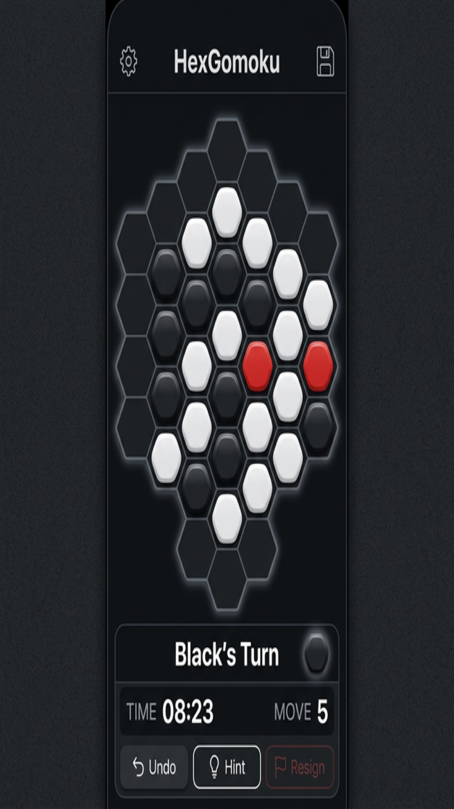

# HexGomoku

A unique hexagonal Gomoku (Five in a Row) board game for iOS and Android.

## Features

- **Hexagonal Board** – Play Gomoku on a beautiful hexagonal grid for a fresh strategic experience
- **Player vs Player** – Challenge friends in local multiplayer mode
- **Player vs AI** – Test your skills against a built-in AI opponent
- **Undo & Hint** – Undo moves and get hints to improve your game
- **Timer & Move Counter** – Track your game progress
- **Dark Theme** – Elegant dark UI designed for comfortable play

## Screenshots

  

## Support

If you have any questions, issues, or feedback, please reach out:

- **Email**: [hexgomoku.game@gmail.com](mailto:hexgomoku.game@gmail.com)
- **Bug Reports**: [GitHub Issues](https://github.com/eric-gao-uni/hexgomoku/issues)
- **Support Page**: See [SUPPORT.md](SUPPORT.md) for detailed support information

## Privacy Policy

HexGomoku does not collect any personal data. All game data is stored locally on your device. See our full [Privacy Policy](store_assets/privacy_policy.html).

## License

© 2026 HexGomoku. All rights reserved.
